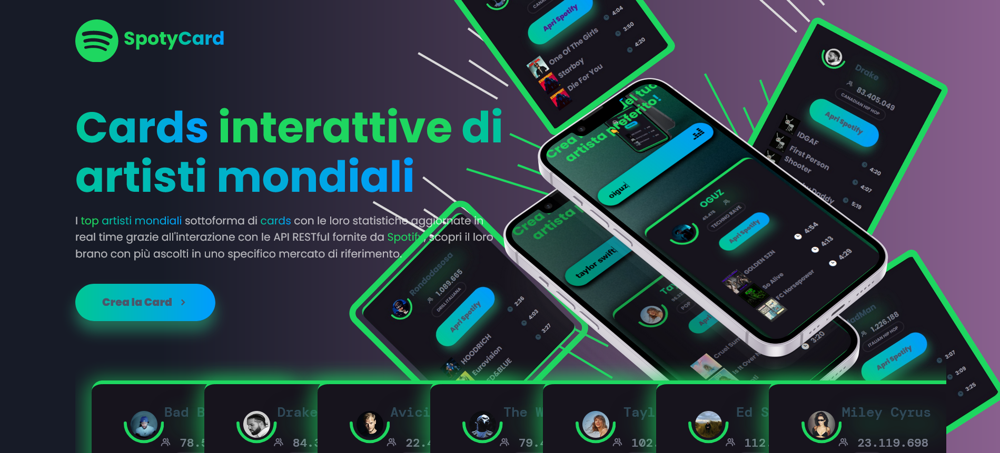

# SpotyCards - Trasform the way we see links!

Introducing SpotyCard – your **premier** platform for seamless artist discovery! Harnessing the dynamic capabilities of Spotify's RESTful APIs, SpotyCard enables users like __yourself__ to effortlessly generate **personalized artist cards** featuring their top 3 most played tracks. Say goodbye to the hassle of extensive searches and hello to **instant access** to your favorite artists' top hits. **Discover, listen, and share** your musical passions with __SpotyCard__ in just a few clicks!

## Table of contents 🗃

- [Overview](#overview)
  - [Screenshot](#screenshot)
  - [Links](#links)
- [My process](#my-process)
  - [Built with](#built-with)
  - [What I learned](#what-i-learned)
- [Author](#author)

## Overview

While delving into the power of RESTful APIs through a FreeCodeCamp video, inspiration struck, leading to the conception of a sleek web app idea: spotlighting the top 7 artists in a specific Spotify market and facilitating user queries for detailed artist information displayed within elegant cards. Drawing inspiration from CSStricks' card layout, I successfully replicated its effect with my own twist, resulting in a stunning visual presentation. Initially grappling with JavaScript during the project's inception due to being in the learning phase, some code segments were redundant and lacked full reliability to the functional paradigm, after a few months i refactored the JS and empowered my web app.

### Screenshot 📷

## Desktop Layout 💻



## Mobile Layout 📱


### Links 🔗

- Live Site URL: [SpotyCard Live Link](https://carvso.github.io/SpotyCard/)

## My process

### Built with

- Semantic HTML5 markup
- CSS custom properties
- Flexbox
- Flexbox Grid
- Mobile-first workflow
- Vanilla JavaScript

### What I learned 📚

How the Spotify API's work?
In RESTful APIs like Spotify's, resources are represented as URIs (Uniform Resource Identifiers), and the actions you can perform on those resources are communicated via standard HTTP methods (such as GET, POST, PUT, DELETE).
To get an access token, you typically need to register your application with Spotify and obtain client credentials (client ID and client secret). You then use these credentials to request an access token by sending a POST request to the Spotify Accounts service with your client credentials and the appropriate scopes. If the request is successful, Spotify will respond with an access token.

In order to make this reliable and foresee any expiration of the **AuthToken**, every time that the window loads, we call our __fetchAccessToken__ thanks to the execution of **await** function __fetchAndPrintArtists()__

```js
const fetchAccessToken = async () => {
  const tokenUrl = "https://accounts.spotify.com/api/token";
  const tokenData = {
    grant_type: "client_credentials",
    client_id: clientId,
    client_secret: clientSecret,
  };

  try {
    const response = await fetch(tokenUrl, {
      method: "POST",
      headers: {
        "Content-Type": "application/x-www-form-urlencoded",
      },
      body: new URLSearchParams(tokenData),
    });
    const data = await response.json();
    accessToken = data.access_token;
    console.log("New access token:", accessToken);
  } catch (error) {
    console.error("Error fetching access token:", error);
    throw error;
  }
};
```
To display artist info an tracks info, after we received our data from the API, we run a **forEach** for each object contained in __artists__, then we print our artist info, thanks to modular and reusable function, we fetch out artist tracks, and do the same thing with different functions for HTML tracks DOM appending.
If no artist is found, we refetch our artist token.

```js
const fetchAndPrintArtists = async () => {
  try {
    await fetchAccessToken();
    const data = await fetchArtists();

    if (data.artists) {
      data.artists.forEach(async (artist, index) => {
        printName(`artist-name-${index + 1}`, artist.name);
        printName(`artist-genre-${index + 1}`, artist.genres[0]);
        printFollowers(`artist-follow-${index + 1}`, artist.followers.total);
        setArtistImage(`artist-img-${index + 1}`, artist.images[0].url);

        const tracks = await fetchTopTracks(artist.id);

        setArtistImage(`album-fi-${index + 1}`, tracks[0].album.images[0].url);
        setArtistImage(`album-sec-${index + 1}`, tracks[1].album.images[0].url);
        setArtistImage(`album-thi-${index + 1}`, tracks[2].album.images[0].url);

        printSongInfo(`song-fi-${index + 1}`, trimToMaxLength(tracks[0].name, 11));
        printSongInfo(`song-sec-${index + 1}`, trimToMaxLength(tracks[1].name, 11));
        printSongInfo(`song-thi-${index + 1}`, trimToMaxLength(tracks[2].name, 11));

        printSongDuration(`duration-fi-${index + 1}`, tracks[0].duration_ms);
        printSongDuration(`duration-sec-${index + 1}`, tracks[1].duration_ms);
        printSongDuration(`duration-thi-${index + 1}`, tracks[2].duration_ms);
      });
    } else {
      console.log('No artists found');
      await fetchAccessToken();
    }
  } catch (error) {
    console.error("Failed to fetch artists:", error);
  }
};
```
## Author 👤

- Website - [Vincenzo Caruso](https://www.carvso.me)
- LinkedIn - [Vincenzo Caruso](https://www.linkedin.com/in/vincenzo-carvso/)